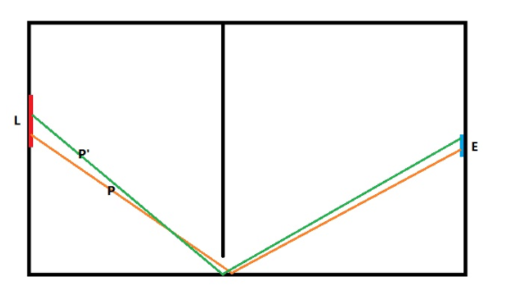
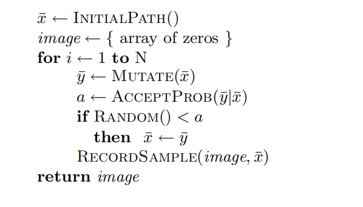
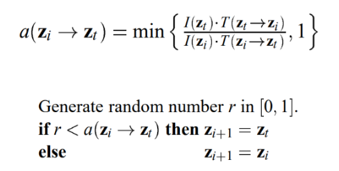

## 计算机图形学

### 期末大作业-光线跟踪核心算法改进
#### 1811338 常珂源_1811457 张泰源

---

**1. 概要**
- 实现了光子映射渲染方法
- 尝试实现 Metropolis 渲染方法（未得到正确结果）

**2. 光子映射渲染方法**

**3. Metropolis渲染方法**
    MLT算法将物理上的Metropolis方法运用到路径采样中，其核心思想在于：发现一条对结果影响更大的有效路径后，在path space中该路径邻近区域采样得到的路径对结果影响较大的可能性会更大。（也就是假设高贡献度路径周围的路径也很可能是高贡献度的）
    
    比如上图的例子，采样到一条有效路径P后，在邻近区域采样很容易得到另一条有效路径P'，从而更高效地搜索有效路径。
    （马尔科夫链帮助采样：根据当前样本和一个概率分布，生成下一个相近的样本）
    **算法流程**
    
 - 通过 INITIALPATH() 找到一条有效路径 x，将x进行变异得到y，计算接受概率 a，如果路径 y 被接受，那么下一次从y进行变异，否则还是从x开始，最后记录该路径的颜色贡献值。
  
 - 接受概率也主要是看新路径和旧路径的贡献度
    
    **需要考虑的问题**
    - MLT的采样过程是上下关联的，即下一次的采样结果依赖于上一次的路径，有可能一直在某个高贡献度的局部区域采样而忽略了其他区域
    > 解决办法：经过一定次数路径变异后重写INITIALPATH
    - 变异函数的选择影响算法效率
    > 在Veach的论文：ROBUST MONTE CARLO METHODS FOR LIGHT TRANSPORT SIMULATION中，Veach使用了几种变异策略：Bidirectional mutations(随机删除中间的部分路径，再添加一段随机路径，这个应该是整个变异方法的主体，特别适用于处理漫反射场景)；Lens perturbations(主要针对LDSE路径作随机扰动，用于处理镜面反射)；Caustic perturbations(针对LSDE路径作微扰，用于处理焦散)；
    **算法优缺点**
    **优点**
    - 复杂的、困难的光路传播效果不错，如半掩的门，水中的聚焦现象等
    - 可以做到以任意函数为pdf生成样本
    **缺点**
    - 所有操作都是局部的，很难分析收敛速度，即不知道要渲染多久
    - 由于不同部分的像素收敛快慢不同，正常看上去图片会比较脏

**4. 渲染结果**
- **光子映射：**
- **MLT：**
  **结果分析**
  - 全是噪声有可能是没有正确记录有效路径的颜色贡献度，或者接受概率有问题导致全都被接受了？
  - 正常来说变异（mutate）次数越多，生成效果会越好，相应的渲染时间也会越长

**5. 实验感想**
  理解框架代码还是有点耗时间的，一开始就尝试实现Metropolis渲染算法也遇到了很多困难，之后参考了论文和PBRT官方的实现后还是没能完全debug，很可惜最后渲染结果还是一堆噪声...可能没完全理解算法细节吧，或者复写框架接口的一些函数没完全写对？也没时间再debug了...希望之后学习图形学的过程中能有机会完全实现。
**6. 参考文献**
[1] Eric Veach, Leonidas J. Guibas, Computer Science Department Stanford University, Metropolis Light Transport.
[2] Physically Based Rendering: From Theory to Implementation, by Matt Pharr, Wenzel Jakob, and Greg Humphreys
[3] https://github.com/mmp/pbrt-v3
[4] https://www.pbr-book.org/3ed-2018/Light_Transport_III_Bidirectional_Methods/Metropolis_Light_Transport
